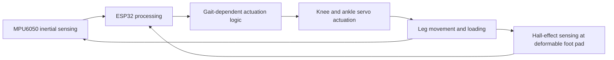
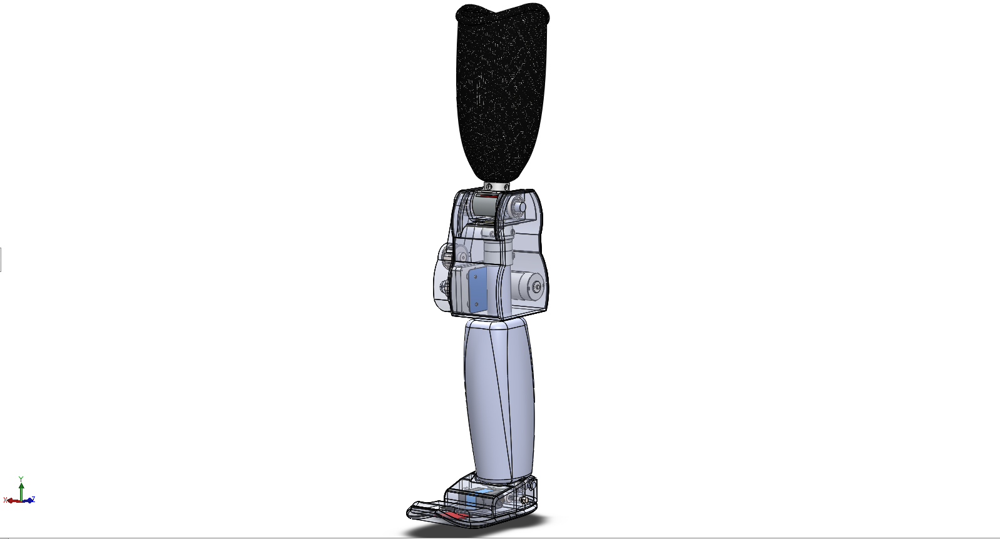

# Methodology and design development

These notes summarize the published system and earlier design studies.

## Published implementation

This diagram summarizes the paper's system description. It does not specify pins, timing, controller gains, sensor calibration, or electrical power connections. 

## Earlier flowchart

`Methodology-flow-chart.docx` contains labels for EMG input, gyroscope/Hall/pressure feedback, a microcontroller, gait-cycle detection, standing/walking/sitting modes, inverse kinematics, motor trajectory, and motor angle. These labels record an earlier design concept. EMG, pressure sensing, and an inverse-kinematics implementation are not established as completed features by these labels.

## Design verification report

`Functional-Verification-of-Multiple-Design-Solutions-part2.docx` describes two design studies:

1. A hydraulic-actuator concept discussed using SolidWorks motion screenshots at approximately 1.5 and 2.9 seconds within a three-second simulation. The supplied screenshots do not establish that a commercial C-Leg was experimentally tested.
2. A sensor-based design with knee/ankle sensing, Hall-effect feedback, and serial-monitor screenshots. The report discusses sensor noise, drift, and combining accelerometer and gyroscope signals.

Source: Figure 4 in the supplied team report, credited there to Nipa, Fahin, Abir, and Mahin. Individual CAD authorship is not identified. The screenshot is evidence of a design study, not an editable CAD release.

## Personal contribution

Musa Ahammed Mahin confirms work on circuit/PCB design, ESP32 programming, sensor testing, trial-and-error refinement, and paper writing. 
