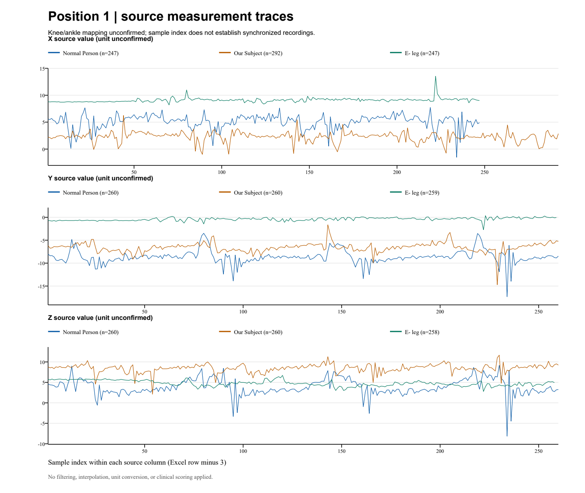
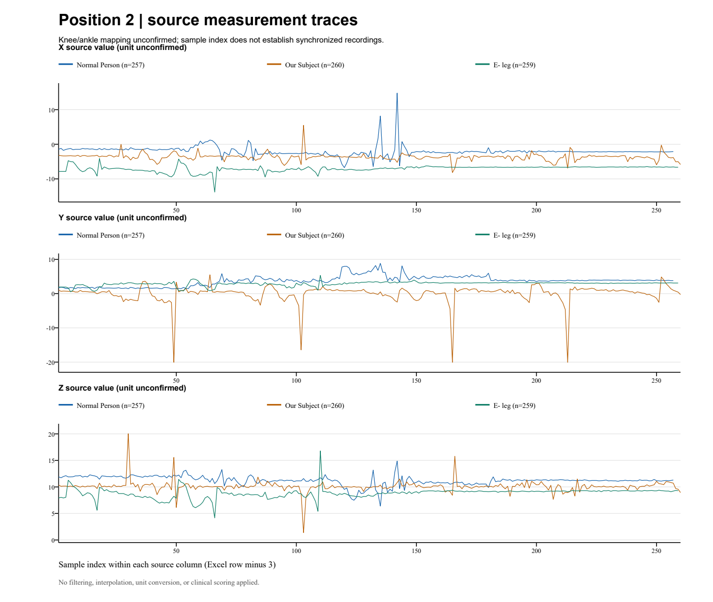

# Measurements and results

[Back to the project overview](../README.md)

This folder contains two measurement workbooks, a CSV export, summary statistics, and plots.

## Files

| Material                               | Location                                            |
| -------------------------------------- | --------------------------------------------------- |
| Position 1 workbook                    | [Position1.xlsx](data/raw/Position1.xlsx)           |
| Position 2 workbook                    | [Position2.xlsx](data/raw/Position2.xlsx)           |
| Exported measurements                  | [measurements.csv](data/processed/measurements.csv) |
| CSV field descriptions                 | [Data dictionary](data/data-dictionary.md)          |
| Counts and statistics for each channel | [channel-summary.csv](results/channel-summary.csv)  |
| Measurement summary and plots          | [Results report](results/report.md)                 |

Open the workbooks in a spreadsheet application, or view the saved CSV files and plots directly. The analysis script and detailed audit JSON are not included in the current folder.

## Understanding the measurements

Both workbooks use `Sheet1`, with numeric data starting at row 4.

| Workbook label | X column | Y column | Z column | Meaning                                                |
| -------------- | -------- | -------- | -------- | ------------------------------------------------------ |
| Normal Person  | A        | B        | C        | Reference condition.                                   |
| Our Subject    | F        | G        | H        | Exact prosthesis or test condition needs confirmation. |
| E- leg         | L        | M        | N        | Exo-leg condition.                                     |

Position 1 and Position 2 refer to knee and ankle measurement positions.. The original workbook labels are kept in the exports and plots.

The export contains **4,671 numeric measurements across 18 channels**. Each row identifies its workbook, sheet, source cell, condition, and axis. Sample index means the Excel row number minus 3; it does not mean elapsed seconds.

## Plots

### Position 1

[Open Position 1 at full size](results/Position1.png).

### Position 2

[Open Position 2 at full size](results/Position2.png).

The plots show saved measurements without smoothing or interpolation. Gaps and different channel lengths are retained. A shared sample index does not establish that recordings were made at the same time.

The summary gives counts, minimums, maximums, means, and sample standard deviations. These describe the recorded values; they do not measure clinical improvement or establish which condition performs better.
