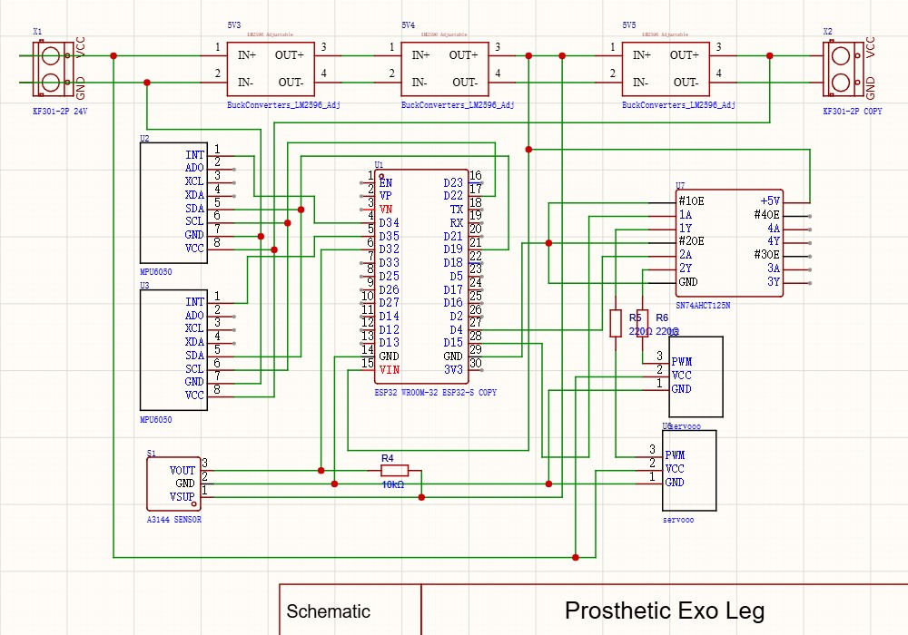
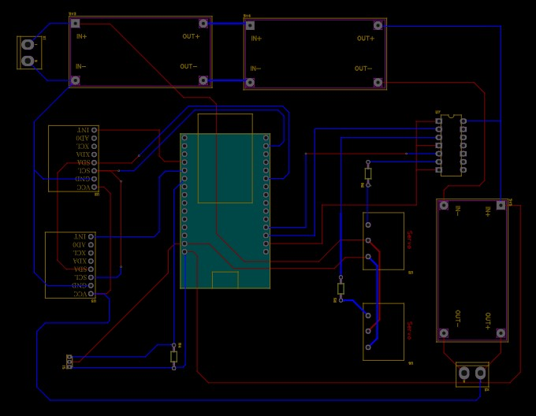
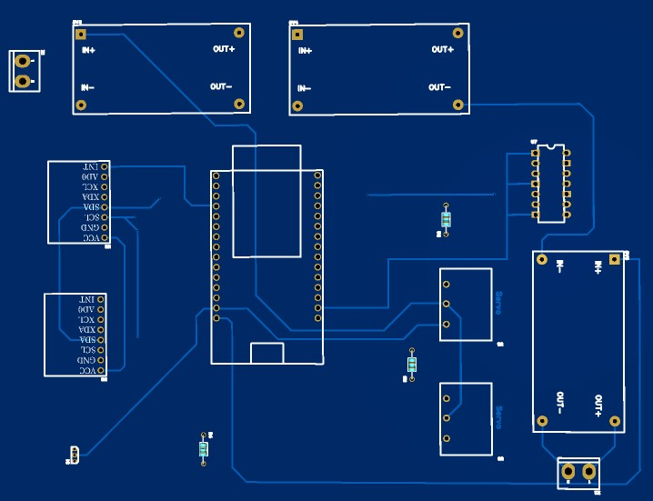

# Hardware

[Back to the project overview](../README.md)

This folder contains the project schematic image, PCB layout image, board preview, and early component budget.

## Files

| File | What it contains |
| --- | --- |
| [Sch-PEL.jpg](Sch-PEL.jpg) | Circuit schematic image. |
| [PCB-PEL.jpg](PCB-PEL.jpg) | PCB layout showing tracks and component positions. |
| [3D-PEL.jpg](3D-PEL.jpg) | Board preview showing component footprints. |
| [BOM-early-design.csv](BOM-early-design.csv) | Early component list and recorded costs. |

## Circuit schematic

[Open the schematic at full size](Sch-PEL.jpg). The image shows an ESP32, two MPU6050 sensors, a Hall-effect sensor, servo connections, and power-converter sections.

## PCB layout

[Open the PCB layout at full size](PCB-PEL.jpg). The source image has a dark background and small labels; use the schematic above to read the component names more clearly.

## Board preview

[Open the board preview at full size](3D-PEL.jpg).

These images are design references. Editable schematic, PCB, manufacturing, and mechanical CAD files are not included. The pin assignments in the [current starter code](../firmware/README.md) should be checked separately against the hardware being used.

## Early component budget

The [budget CSV](BOM-early-design.csv) records an early design with a Raspberry Pi, EMG and other sensors, servo motors, mechanical parts, and a battery. It differs from the ESP32-based implementation described in the paper.

The recorded totals contain arithmetic differences. The original CSV is preserved; its line-item sums are explained below.

| Amount | Recorded in the CSV | Sum of the listed component totals |
| --- | ---: | ---: |
| Components, BDT | 36,847 | 30,490 |
| Components, USD | 429.44 | 354.50 |
| Including listed miscellaneous cost, BDT | 37,347 | 30,990 |
| Including listed miscellaneous cost, USD | 435.39 | 360.45 |

The USD values use the amounts already in the CSV, without a new currency conversion. This early budget is separate from the paper's final prototype cost of **US$814.84**.
